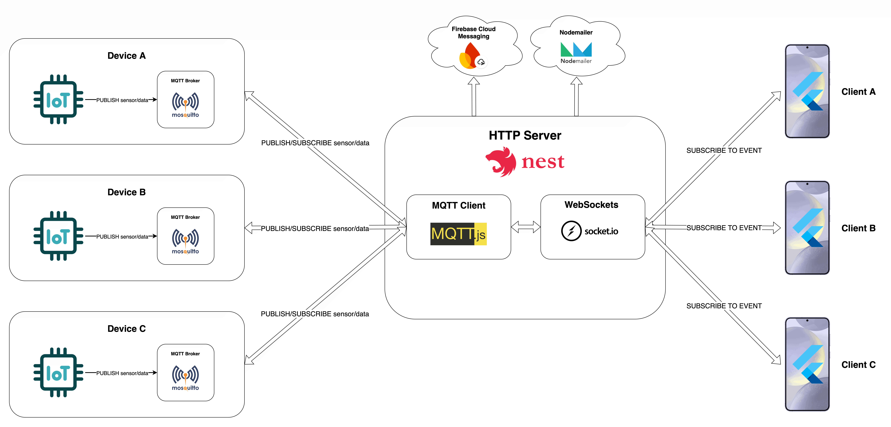

<p align="center">
  
</p>

# Antares Insight

## Description

This repository contains the proof of concept of [Antares'](https://antares.id) alerting and notification IoT system by utilizing MQTT over WebSockets. This backend system is implemented with the following technologies:

| Component            | Technology                                                                       |
| -------------------- | -------------------------------------------------------------------------------- |
| HTTP Server          | [NestJS](https://nestjs.com)                                                     |
| Websocket Server     | [Socket.IO](https://socket.io)                                                   |
| MQTT Broker          | [Mosquitto](https://www.mosquitto.org)                                           |
| Notification Service | [Firebase Cloud Messaging](https://firebase.google.com/products/cloud-messaging) |
| Mailing Service      | [Nodemailer](https://nodemailer.com)                                             |
| API Documentation    | [Swagger](https://swagger.io)                                                    |

## Architectural Overview



## Project setup

```bash
# clone the repository
$ git clone git@github.com:fzl-22/antares-insight-backend.git

# navigate to the project
$ cd antares-insight-backend

# install dependencies
$ npm install
```

## Compile and run the project

```bash
# development mode
$ npm run start

# watch mode
$ npm run start:dev

# production mode
$ npm run start:prod

# containerized mode
$ docker compose -f docker-compose.[dev|prod].yml up --build
```

<!-- ## Run tests

```bash
# unit tests
$ npm run test

# e2e tests
$ npm run test:e2e

# test coverage
$ npm run test:cov
``` -->

## Documentation

Documentation is generated for every compilation and can be found in [http://localhost:3000/api/docs](http://localhost:3000/api/docs).

<!-- ## Resources

Check out a few resources that may come in handy when working with NestJS:

- Visit the [NestJS Documentation](https://docs.nestjs.com) to learn more about the framework.
- For questions and support, please visit our [Discord channel](https://discord.gg/G7Qnnhy).
- To dive deeper and get more hands-on experience, check out our official video [courses](https://courses.nestjs.com/).
- Visualize your application graph and interact with the NestJS application in real-time using [NestJS Devtools](https://devtools.nestjs.com).
- Need help with your project (part-time to full-time)? Check out our official [enterprise support](https://enterprise.nestjs.com).
- To stay in the loop and get updates, follow us on [X](https://x.com/nestframework) and [LinkedIn](https://linkedin.com/company/nestjs).
- Looking for a job, or have a job to offer? Check out our official [Jobs board](https://jobs.nestjs.com).

## Support

Nest is an MIT-licensed open source project. It can grow thanks to the sponsors and support by the amazing backers. If you'd like to join them, please [read more here](https://docs.nestjs.com/support).

## Stay in touch

- Author - [Kamil Myśliwiec](https://twitter.com/kammysliwiec)
- Website - [https://nestjs.com](https://nestjs.com/)
- Twitter - [@nestframework](https://twitter.com/nestframework)

## License

Nest is [MIT licensed](https://github.com/nestjs/nest/blob/master/LICENSE). -->
